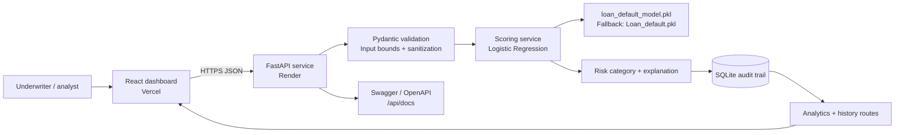

# Lumen Credit architecture

## Request flow

1. React validates required numeric ranges and submits the 16 model fields plus optional previous defaults.
2. FastAPI rejects unknown fields, sanitizes bounded text, applies CORS and rate limiting, and maps dataset categories to their encoded values.
3. The saved artifact produces a default probability. The service derives the binary status, three risk categories, and plain-language factors.
4. The applicant payload, score, category, status, model version, and timestamp are stored in SQLite.
5. Dashboard widgets query aggregate analytics and recent history without exposing raw model internals.
